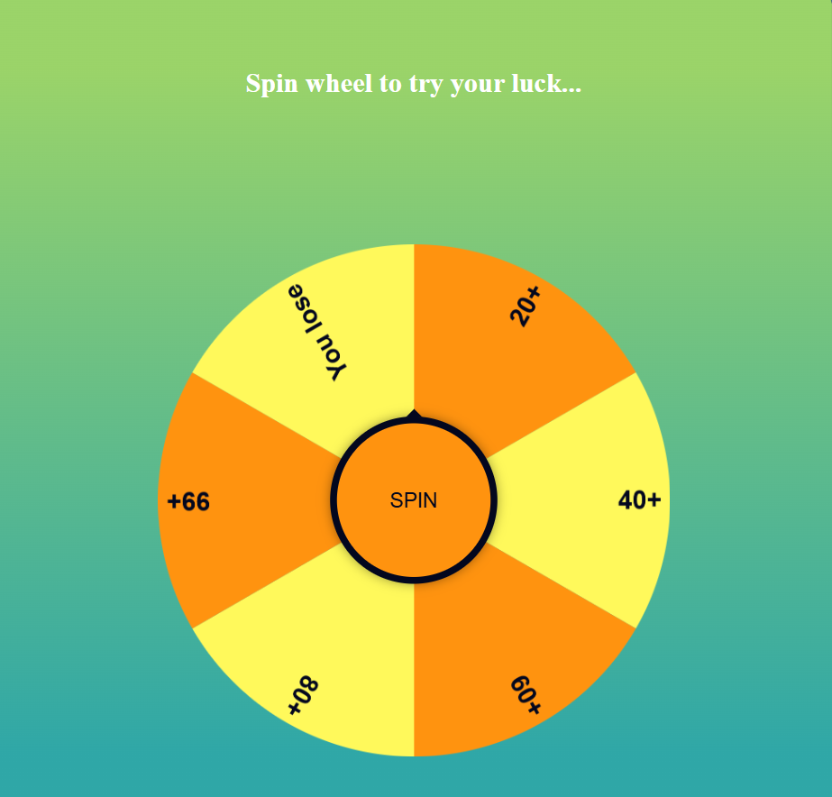

# 🎡 Spin Wheel Game

An interactive Spin Wheel web application built using HTML, CSS, and JavaScript.  
Users can spin the wheel to randomly select a result from predefined options.  
Perfect for lucky draws, giveaways, and fun mini-games.

---

## 📸 Project Preview

> Make sure your image file `spin-wheel.png` is in the root folder of your project.  
> If it's inside a folder (for example `assets`), then use:
>
> 

---

## 🚀 Features

- Smooth spinning animation  
- Random result generation  
- Responsive design  
- Easy to customize  
- Lightweight and simple code  

---

## 🛠️ Technologies Used

- HTML5  
- CSS3  
- JavaScript (Vanilla JS)  

---

## 📂 Project Structure
spin-wheel/
│
├── index.html
├── style.css
├── script.js
├── spin-wheel.png
└── README.md

---

## ⚙️ How to Run

1. Download or clone the repository  
2. Open the project folder  
3. Double click on `index.html`  
4. Click the **Spin** button  

---

## 🎯 Customization

You can edit:

- Wheel options in `script.js`
- Colors and styling in `style.css`
- Layout structure in `index.html`

---

## 📌 Use Cases

- Lucky draw system  
- Giveaway picker  
- Decision-making tool  
- Fun web mini project  

---

## 👤 Author

Anany  
GitHub: https://github.com/anany404